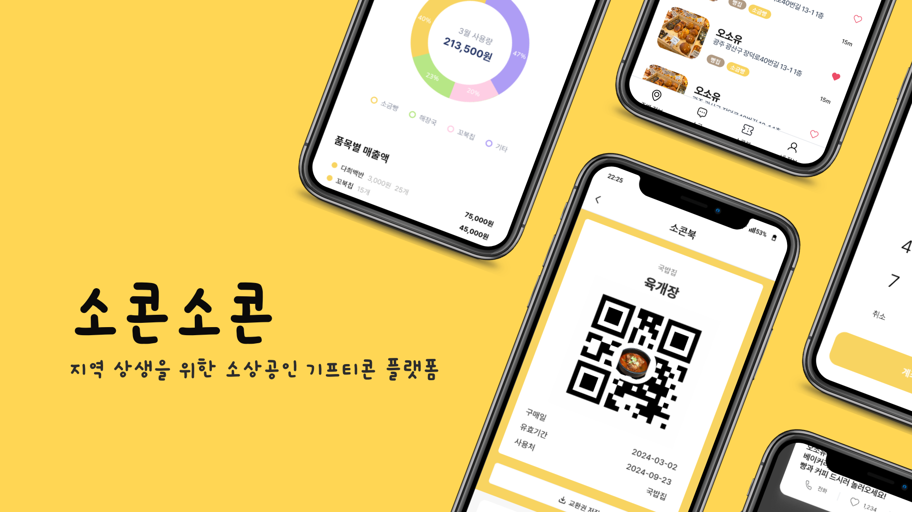
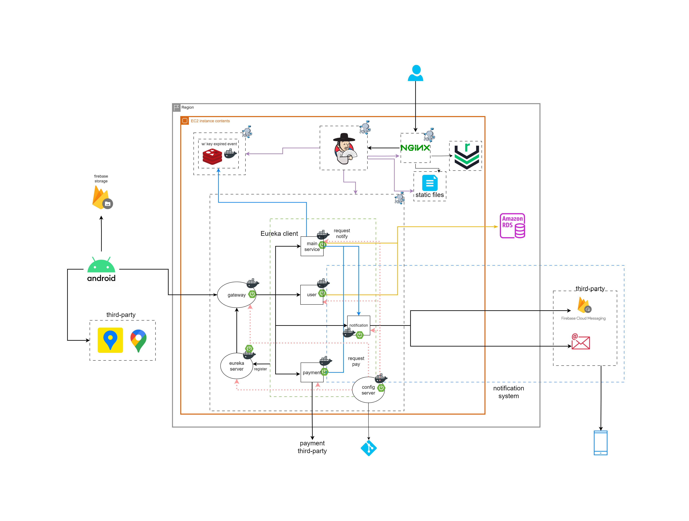
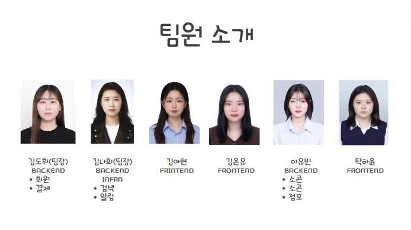

# 소콘소콘 - 지역 상생을 위한 소상공인 기프티콘 플랫폼




### [APK 다운로드 링크](https://drive.google.com/file/d/17TWXifs8DuklDvbsJdlm-SdqQQqkzMVm/view?usp=drive_link)

## ✔ 프로젝트 진행 기간
2024.03. ~ 2024.04.

---

## ✔ 주요 기능
### [소콘] 
  - 점주
  - 사용자
### [소곤]
### [알림]

---

## ✔ 주요 기술

* **Mobile Operating Systems**<br/>
  

* **Languages and Frameworks**<br/>
   

* **Database and Caching**<br/>
    

* **Development and Deployment Tools**<br/>
     

* **Cloud Storage, Cloud Message**<br/>

* **Web Server and Infrastructure**<br/>
    

* **Design and Project Management**<br/>
    

* **Environments**<br/>
   
---

## ✔ 프로젝트 구조


---
## ✔ 프로젝트 파일 구조
### Frontend

```
├── README.md
├── analysis_options.yaml
├── android
│   ├── app
│   │   ├── build.gradle
│   │   └── src
│   │       ├── debug
│   │       │   └── AndroidManifest.xml
│   │       ├── main
│   │       │   ├── AndroidManifest.xml
│   │       │   ├── ic_launcher-playstore.png
│   │       │   ├── java
│   │       │   ├── kotlin
│   │       │   └── res
│   │       │       ├── drawable
│   │       │       ├── drawable-v21
│   │       │       ├── mipmap-anydpi-v26
│   │       │       ├── mipmap-hdpi
│   │       │       ├── mipmap-mdpi
│   │       │       ├── mipmap-xhdpi
│   │       │       ├── mipmap-xxhdpi
│   │       │       ├── mipmap-xxxhdpi
│   │       │       ├── values
│   │       │       └── values-night
│   │       └── profile
│   ├── build.gradle
│   ├── gradle
│   ├── gradle.properties
│   └── settings.gradle
├── assets
│   ├── fonts
│   │   ├── bagelFatOne
│   │   └── pretendard
│   ├── icons
│   └── images
├── devtools_options.yaml
├── frontend.txt
├── lib
│   ├── firebase_options.dart
│   ├── main.dart
│   ├── models
│   │   ├── business_owner.dart
│   │   ├── location.dart
│   │   ├── locations.dart
│   │   ├── mystore_detail_menu.dart
│   │   ├── mystore_detail_menu_list_model.dart
│   │   ├── mystore_lists_model.dart
│   │   ├── notification.dart
│   │   ├── place_params.dart
│   │   ├── product_detail_model.dart
│   │   ├── socon_add.dart
│   │   ├── socon_book.dart
│   │   ├── socon_card.dart
│   │   ├── sogon_detail.dart
│   │   ├── sogon_place.dart
│   │   ├── sogon_register.dart
│   │   ├── store.dart
│   │   ├── store_register_model.dart
│   │   └── user.dart
│   ├── provider
│   │   ├── Address.dart
│   │   └── Boss_provider.dart
│   ├── routes
│   │   ├── router.dart
│   │   └── tab_routes.dart
│   ├── services
│   │   ├── auth_service.dart
│   │   ├── boss_verification_service.dart
│   │   ├── image_manager_service.dart
│   │   ├── my_socon_service.dart
│   │   ├── mystore_detail_menu_list_service.dart
│   │   ├── mystore_lists_service.dart
│   │   ├── notifications
│   │   ├── payment_service.dart
│   │   ├── permission_handler.dart
│   │   ├── qr_publishing_service.dart
│   │   ├── sogon_service.dart
│   │   ├── store_register_service.dart
│   │   └── stores_service.dart
│   ├── utils
│   │   ├── api
│   │   ├── colors.dart
│   │   ├── firebase_utils.dart
│   │   ├── fontSizes.dart
│   │   ├── icon_paths.dart
│   │   ├── icons.dart
│   │   ├── location
│   │   ├── responsive_utils.dart
│   │   ├── result_msg_type.dart
│   │   ├── string_utils.dart
│   │   └── toast_utils.dart
│   ├── viewmodels
│   │   ├── boss_verification_view_model.dart
│   │   ├── login_state_view_model.dart
│   │   ├── menu.dart
│   │   ├── my_socon_view_model.dart
│   │   ├── mystore_detail_menu_list_view_model.dart
│   │   ├── notification_view_model.dart
│   │   ├── payment_verification_view_model.dart
│   │   ├── qr_generate_view_model.dart
│   │   ├── sign_in_view_model.dart
│   │   ├── sign_up_view_model.dart
│   │   ├── socon_coupon_view_model.dart
│   │   ├── sogon_view_model.dart
│   │   ├── store_product_view_model.dart
│   │   ├── store_register_view_model.dart
│   │   ├── store_socon_card_view_model.dart
│   │   └── stores_view_model.dart
│   └── views
│       ├── atoms
│       │   ├── bottom_bar.dart
│       │   ├── bottom_sheet.dart
│       │   ├── buttons.dart
│       │   ├── checkbox.dart
│       │   ├── dropdown.dart
│       │   ├── icon_loader.dart
│       │   ├── image_card.dart
│       │   ├── image_loader.dart
│       │   ├── input_form.dart
│       │   ├── inputs.dart
│       │   ├── modal.dart
│       │   ├── qr_code.dart
│       │   ├── search_box.dart
│       │   ├── socon_menu_management.dart
│       │   ├── socon_storesocon.dart
│       │   ├── switch.dart
│       │   ├── tab.dart
│       │   ├── tag_icon.dart
│       │   ├── text_area.dart
│       │   └── toast.dart
│       ├── modules
│       │   ├── add_menu_card.dart
│       │   ├── app_bar.dart
│       │   ├── cards
│       │   ├── fail_card.dart
│       │   ├── menu_detail_top_card.dart
│       │   ├── my_store_analysis.dart
│       │   ├── my_store_lists.dart
│       │   ├── mystore_menu_card.dart
│       │   ├── mystore_menu_management.dart
│       │   ├── mystore_rigister_menu_lists.dart
│       │   ├── place_list.dart
│       │   ├── place_list_card.dart
│       │   ├── plus_minus_btn.dart
│       │   ├── search_module.dart
│       │   ├── socon_coupon.dart
│       │   ├── socon_mysocon.dart
│       │   ├── socon_storesocon.dart
│       │   ├── store_detail_top_card.dart
│       │   ├── store_top_card.dart
│       │   └── success_card.dart
│       ├── payments
│       └── screens
│           ├── bossVerification
│           ├── contact
│           ├── kpostal_screen.dart
│           ├── myStore
│           ├── my_info_screen.dart
│           ├── my_store_list_screen.dart
│           ├── nearby_info_screen.dart
│           ├── payment
│           ├── sign_in_screen.dart
│           ├── sign_up_screen.dart
│           ├── soconBook
│           ├── sogon
│           ├── sogon_main_screen.dart
│           ├── stores
│           └── webView
├── linux
│   └── flutter
│       ├── generated_plugin_registrant.cc
│       └── generated_plugins.cmake
├── macos
│   └── Flutter
│       └── GeneratedPluginRegistrant.swift
├── pubspec.lock
├── pubspec.yaml
├── test
│   └── widget_test.dart
└── windows
    └── flutter
        ├── generated_plugin_registrant.cc
        └── generated_plugins.cmake
```

### Backend
**전체 구조**
```
├── auth
├── config
├── eureka
├── gateway
├── notification
├── payment
├── socon
├── user
└── utils
```
각 프로젝트는 다음과 같은 도메인 구조로 구성

```
├── Dockerfile
├── build
│   ├── classes
│   ├── generated
│   ├── resources
│   └── tmp
├── build.gradle
├── docker-compose.yml
├── gradle
│   └── wrapper
├── gradle.properties
├── gradlew
├── gradlew.bat
├── settings.gradle
└── src
    ├── main
    │   ├── java
    │   │   └── site
    │   │       └── soconsocon
    │   │           └── socon
    │   │               ├── SoconApplication.java
    │   │               ├── global
    │   │               │   ├── GeoUtils.java
    │   │               │   ├── config
    │   │               │   ├── domain
    │   │               │   └── exception
    │   │               ├── search
    │   │               │   ├── controller
    │   │               │   ├── domain
    │   │               │   │   ├── document
    │   │               │   │   └── dto
    │   │               │   │       ├── common
    │   │               │   │       ├── request
    │   │               │   │       └── response
    │   │               │   ├── exception
    │   │               │   ├── repository
    │   │               │   │   └── elasticsearch
    │   │               │   └── service
    │   │               ├── sogon
    │   │               │   ├── controller
    │   │               │   ├── domain
    │   │               │   │   ├── dto
    │   │               │   │   │   ├── feign
    │   │               │   │   │   ├── request
    │   │               │   │   │   └── response
    │   │               │   │   └── entity
    │   │               │   │       └── jpa
    │   │               │   ├── exception
    │   │               │   ├── feign
    │   │               │   ├── repository
    │   │               │   │   └── jpa
    │   │               │   └── service
    │   │               └── store
    │   │                   ├── controller
    │   │                   ├── domain
    │   │                   │   ├── dto
    │   │                   │   │   ├── request
    │   │                   │   │   └── response
    │   │                   │   └── entity
    │   │                   │       ├── feign
    │   │                   │       ├── jpa
    │   │                   │       └── redis
    │   │                   ├── exception
    │   │                   ├── feign
    │   │                   ├── repository
    │   │                   │   ├── jpa
    │   │                   │   └── redis
    │   │                   ├── scheduler
    │   │                   └── service
    │   └── resources
    │       └── application.yml
    └── test
```

## ✔ 협업 환경

- Gitlab
    - 코드 버전 관리
    - git flow 브랜치 전략 채택
- JIRA
    - 전주 주말 다음주 목표량을 설정하여 Sprint 진행
    - 업무의 할당량을 정하여 Story Point를 설정 후 진행도 실시간 반영
    - 소멸 차트를 통해 프로젝트 진행도 확인
- Notion
    - 회의록 기록
    - 학습 내용 정리 및 공유
    - 컨벤션 정리

## ✔ 팀원 역할 분배


## ✔ 프로젝트 산출물
- [아키텍처](#-프로젝트-구조)
- [컨벤션](docs/docs/convention.md)

## ✔ 프로젝트 결과물
- [포팅메뉴얼](exec/소콘소콘_포팅_메뉴얼.pdf)

## ✔ 서비스 화면
|                   로그인                    |                  사업자 인증                  |
|:----------------------------------------:|:----------------------------------------:|
| .jpg)  | .jpg)  |
|                   점포등록                   |                  점포 리스트                  |
| .jpg)  | .jpg)  |
|                  소콘 발행                   |                 아임포트 결제                  |
| .jpg) | .jpg) |