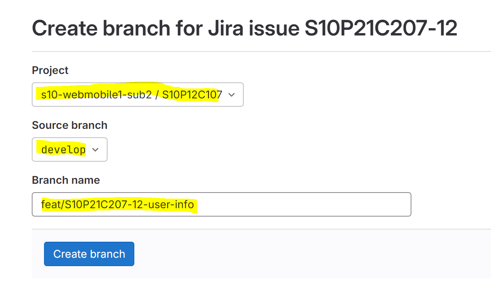

### 빌드를 위한 Merge Request

labels에서 빌드를 의도한 구분(BE/FE)를 선택해 push한다.


### 브랜치 전략

- 붕방붕방은  **Git Flow**을 채택한다.
    - 애자일 프로젝트라는 점과 사이즈가 크지않고 개발인원이 5명뿐인 현 특성 상 적합하지 않지만 아래 두 사유에서 더 복잡한 Git flow 전략을 채택하게 되었다.
        1. 취업을 준비하고 있음
        2. 현업에서 적용되는 방식을 경험해볼 필요가 있음
- 고민했던 두 브랜치 전략, **Git Flow vs GitHub Flow**
    - Git Flow

      

        - 종류
            - master : 테스트와 수정이 끝난 안정된 배포 버전이 관리되는 브랜치
            - develop : 다음 출시 버전을 개발하는 브랜치
            - release : develop에서 개발된 다음 출시 버전을 테스트하고 수정하는 브랜치
            - hotfix : 배포 후 release 단계에서 발견하지 못한 오류를 수정하는 브랜치
            - feature : 새로운 기능을 개발하는 브랜치
        - 장점
            - 테스트와 검증 걸차를 걸쳐 배포 안정성과 버전 관리 및 롤백 등 체계적인 운영이 가능
        - 단점
            - 더 많은 제어와 복잡성을 가지고 있어 특정 기능이나 수정을 빠르게 배포해야 할 경우 등에서 유연성이 다소 떨어진다.
            - 브랜치 종류가 많기 때문에 충돌 가능성이 높다.
    - Github Flow

      

        - 종류
            - master : 배포 코드가 관리되는 브랜치
            - feature : 새로운 기능이나 수정사항이 작성되는 브랜치
        - 장점
            - 단순하고 빠르게 기능을 테스트하고 Agile 하게 배포할 수 있기 때문에, 주로 각 환경의 구분이 명확하지 않고 작은 규모의 프로젝트에 적합하다.
        - 단점
            - 테스트와 검증 절차를 거치지 않고 바로 `master` 브랜치로 병합되므로 위험성이 있다.

### JIRA와 깃의 연결

- 브랜치 네이밍 컨벤션

  다음과 같은 네이밍 형식으로 브랜치를 생성한다.

    ```bash
    {타입}/{지라 이슈 넘버}-{간단한 설명}
    ```

  만약, `S10P21C207-12`라는 이슈 넘버를 가진 이슈에서 사용자 정보를 관리하는 기능을 추가하는 feature 브랜치를 생성한다면 해당 브랜치는 `feat/S10P21C207-12-user-info`라는 이름를 갖게된다.

- 스토리를 기준으로 브랜치를 생성한다.

  

  

  gitlab에서 브랜치를 생성할 때 프로젝트가 정확히 지정되어있는지, source 브랜치가 develop으로 변경되었는지 branch name이 정확히 지정되었는지 확인한다.

- task를 커밋을 묶는 단위로 사용한다.

  다음과 같이 `이슈 넘버`를 커밋 메세지에 포함하면 태스크에 커밋이 자동 연결된다.

    ```bash
    {타입}: {커밋 제목} {이슈 넘버} 
    ```


### Commit message convention
### 

| 커밋 유형 | 의미 |
| --- | --- |
| feat | 새로운 기능 추가 |
| fix | 버그 수정 |
| chore | 패키지 매니저 수정, 그 외 기타 수정 ex) .gitignore |
| docs | 문서 수정 |
| refactor | 코드 리팩토링 |
| test | 테스트 코드, 리팩토링 테스트 코드 추가 |
- 여러가지 항목이 있다면 글머리 기호를 통해 가독성 높이기

    ```
    - 변경 내용 1
    - 변경 내용 2
    - 변경 내용 3
    ```

- 종합

    ```bash
    {타입}: {커밋 제목} {이슈 넘버} 
    
    - 변경 내용 1
    - 변경 내용 2
    - 변경 내용 3
    ```

    1. 머리말과 본문은 빈 행으로 분리
    2. 모든 말 끝에 `.` 금지
    3. 제목과 본문은 한영어를 사용